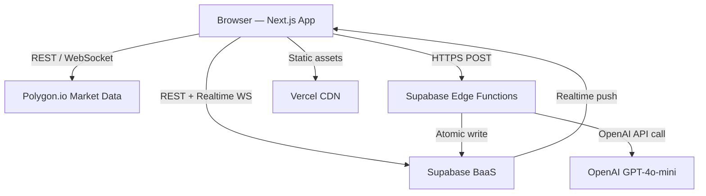

# System Design Document (SDD)

**Project:** PaperTradeX — Zero-consequence AI-coached trading simulator
**Date:** 2026-06-01
**Version:** 0.2
**Owner:** Founder [TBD — confirm]
**Status:** Draft
**PRD:** [prd-papertradex.md](prd-papertradex.md)

---

## 1. Architectural Vision & Principles

**Architecture style:** Next.js 15 App Router web client (React 19) + Supabase BaaS (Postgres, Auth, Realtime, Edge Functions). Market data is fetched from Polygon.io REST + WebSocket APIs. AI coaching calls OpenAI GPT-4o-mini via Supabase Edge Functions — server-side, so the API key never reaches the browser. The product is a monorepo: `/app` for the Next.js client, `/supabase` for schema migrations and edge functions. Deployed on Vercel (client) + Supabase Cloud (backend).

**Guiding principles:**

- Server-of-record for all trade state: trades and AI coaching results are written to Supabase immediately; client is optimistic but Supabase is truth
- AI key isolation: OpenAI calls only happen via Supabase Edge Function; the key never reaches the client bundle
- Market data as a display layer: live prices are UI state, not persisted; only executed paper trade prices are stored in the DB
- Fail-safe AI: every coaching call has a rule-based fallback that fires instantly if the Edge Function is unavailable

**Key trade-offs made:**

- Polygon.io free tier = 15-second delayed quotes in V1. Acceptable for a paper-trading educational tool; real-time upgrade ($29/mo) deferred until post-launch. Labeled clearly in UI.
- Supabase over a custom API: trades speed of development for operational complexity. V1 is not multi-region; single-region Postgres is fine for launch scale.
- Edge Functions for AI: adds ~200ms cold start on first daily call. Accepted because it is the only way to keep the OpenAI key server-side without a separate backend service.

---

## 2. High-Level Architecture



**Layers:**

| Layer | Technology | Responsibility |
|-------|-----------|----------------|
| Client | Next.js 15 App Router + React 19 | UI, trade form, portfolio dashboard, fingerprint viz |
| BaaS / API | Supabase (Postgres + PostgREST + Auth + Realtime) | Auth, trade persistence, fingerprint data, leaderboards |
| Edge Functions | Supabase Edge Functions (Deno) | AI coaching proxy; milestone checks; bias aggregation |
| Market Data | Polygon.io REST + WebSocket | Live/delayed price quotes, ticker search, OHLCV |
| AI | OpenAI GPT-4o-mini via Edge Function | Per-trade bias coaching and weekly digest |
| Infrastructure | Vercel (client) + Supabase Cloud (backend) | Build pipeline, CDN, managed Postgres |

---

## 3. Data Architecture

**Primary database:** Supabase Postgres — *reason: built-in RLS, realtime subscriptions, PostgREST auto-generated REST API, auth integration*
**Secondary / cache:** React Query client-side cache — *reason: optimistic updates for trade execution, stale-while-revalidate for portfolio data*
**Vector store:** N/A — no semantic search in V1

**Core entities:**

```
users
  id:               UUID (Supabase auth.users FK)
  created_at:       TIMESTAMPTZ DEFAULT now()
  display_name:     TEXT
  starting_capital: NUMERIC DEFAULT 50000
  market_interests: TEXT[] CHECK (elements IN ('stocks','crypto','both'))

portfolios
  id:               UUID PRIMARY KEY DEFAULT gen_random_uuid()
  user_id:          UUID REFERENCES users(id) ON DELETE CASCADE
  cash_balance:     NUMERIC NOT NULL DEFAULT 50000
  created_at:       TIMESTAMPTZ DEFAULT now()
  updated_at:       TIMESTAMPTZ DEFAULT now()

positions
  id:               UUID PRIMARY KEY DEFAULT gen_random_uuid()
  portfolio_id:     UUID REFERENCES portfolios(id) ON DELETE CASCADE
  ticker:           TEXT NOT NULL
  quantity:         NUMERIC NOT NULL
  avg_cost:         NUMERIC NOT NULL
  asset_type:       TEXT CHECK (asset_type IN ('stock','crypto'))
  updated_at:       TIMESTAMPTZ DEFAULT now()

trades
  id:               UUID PRIMARY KEY DEFAULT gen_random_uuid()
  portfolio_id:     UUID REFERENCES portfolios(id)
  ticker:           TEXT NOT NULL
  action:           TEXT CHECK (action IN ('buy','sell'))
  quantity:         NUMERIC NOT NULL
  price:            NUMERIC NOT NULL
  total_value:      NUMERIC NOT NULL
  executed_at:      TIMESTAMPTZ DEFAULT now()
  ai_coaching_id:   UUID REFERENCES ai_coaching_events(id)

ai_coaching_events
  id:               UUID PRIMARY KEY DEFAULT gen_random_uuid()
  trade_id:         UUID REFERENCES trades(id)
  user_id:          UUID REFERENCES users(id)
  bias_label:       TEXT CHECK (bias_label IN (
                      'FOMO','panic_sell','loss_aversion','overconfidence',
                      'recency_bias','anchoring','disposition_effect'
                    )) -- nullable; panic_sell increments loss_aversion_count
  psychology_note:  TEXT  -- plain-English why-the-brain-does-this (≤150 chars)
  confidence:       NUMERIC CHECK (confidence BETWEEN 0 AND 1)
  coach_message:    TEXT
  explanation:      TEXT
  is_fallback:      BOOLEAN DEFAULT false
  flagged:          BOOLEAN DEFAULT false
  created_at:       TIMESTAMPTZ DEFAULT now()

behavioral_fingerprints
  id:                        UUID PRIMARY KEY DEFAULT gen_random_uuid()
  user_id:                   UUID REFERENCES users(id) ON DELETE CASCADE UNIQUE
  fomo_count:                INTEGER DEFAULT 0
  loss_aversion_count:       INTEGER DEFAULT 0
  overconfidence_count:      INTEGER DEFAULT 0
  recency_bias_count:        INTEGER DEFAULT 0
  anchoring_count:           INTEGER DEFAULT 0
  disposition_effect_count:  INTEGER DEFAULT 0
  total_trades:              INTEGER DEFAULT 0
  updated_at:                TIMESTAMPTZ DEFAULT now()

education_modules
  id:               UUID PRIMARY KEY DEFAULT gen_random_uuid()
  title:            TEXT NOT NULL
  content:          JSONB NOT NULL
  topic:            TEXT CHECK (topic IN ('blockchain','defi','risk_management','options_prereq'))
  gates_instruments: TEXT[]  -- e.g. ['options','altcoin_extended']; empty = informational only
  order_index:      INTEGER
  quiz_pass_score:  INTEGER DEFAULT 80

user_module_progress
  id:               UUID PRIMARY KEY DEFAULT gen_random_uuid()
  user_id:          UUID REFERENCES users(id)
  module_id:        UUID REFERENCES education_modules(id)
  started_at:       TIMESTAMPTZ
  completed_at:     TIMESTAMPTZ
  quiz_score:       INTEGER
  UNIQUE(user_id, module_id)

weekly_debriefs
  id:               UUID PRIMARY KEY DEFAULT gen_random_uuid()
  user_id:          UUID REFERENCES users(id)
  week_start:       DATE NOT NULL
  summary_json:     JSONB NOT NULL  -- replay_entries, top_biases, improvement_focus
  generated_at:     TIMESTAMPTZ DEFAULT now()
  UNIQUE(user_id, week_start)

school_groups
  id:               UUID PRIMARY KEY DEFAULT gen_random_uuid()
  name:             TEXT NOT NULL
  join_code:        TEXT UNIQUE NOT NULL
  teacher_user_id:  UUID REFERENCES users(id)
  competition_start: TIMESTAMPTZ
  competition_end:   TIMESTAMPTZ
  leaderboard_mode:  TEXT CHECK (leaderboard_mode IN ('return_pct','risk_adjusted','learning_completion'))
  created_at:       TIMESTAMPTZ DEFAULT now()

classroom_scenarios  -- V1.1
  id:               UUID PRIMARY KEY DEFAULT gen_random_uuid()
  group_id:         UUID REFERENCES school_groups(id)
  scenario_key:     TEXT CHECK (scenario_key IN ('crash_2008','crypto_boom_2021','custom'))
  assigned_at:      TIMESTAMPTZ DEFAULT now()

certificates  -- V1.1
  id:               UUID PRIMARY KEY DEFAULT gen_random_uuid()
  user_id:          UUID REFERENCES users(id)
  track_title:      TEXT NOT NULL
  verification_id:  TEXT UNIQUE NOT NULL
  issued_at:        TIMESTAMPTZ DEFAULT now()

group_memberships
  id:               UUID PRIMARY KEY DEFAULT gen_random_uuid()
  group_id:         UUID REFERENCES school_groups(id)
  user_id:          UUID REFERENCES users(id)
  joined_at:        TIMESTAMPTZ DEFAULT now()
  UNIQUE(group_id, user_id)
```

**Key relationships:**

- users has one portfolio (1:1)
- users has one behavioral_fingerprint (1:1)
- portfolio has many positions (1:N)
- portfolio has many trades (1:N)
- trades has one ai_coaching_event (1:1)
- users has many user_module_progress (1:N)
- school_groups has many group_memberships (1:N)

**Caching strategy:**

- Portfolio balance and positions: React Query with 30-second stale time; invalidated on new trade execution
- Live prices: ephemeral in-component state via Polygon.io WS; never persisted to DB
- Behavioral fingerprint: fetched once per session, updated optimistically after each coaching event
- Leaderboard: 60-second polling; no realtime subscription (performance tradeoff acceptable for V1)

---

## 4. API Design & External Integrations

**API style:** REST via Supabase PostgREST + custom Supabase Edge Functions for AI proxy and complex queries. Client uses `@supabase/supabase-js` v2.

**Internal endpoints (high-level):**

| Method | Path | Purpose |
|--------|------|---------|
| `POST` | `/auth/v1/signup` | Create account |
| `POST` | `/auth/v1/token` | Login |
| `GET`  | `/rest/v1/portfolios?user_id=eq.{id}` | Get user portfolio |
| `GET`  | `/rest/v1/positions?portfolio_id=eq.{id}` | Get user positions |
| `POST` | `/rest/v1/trades` | Execute a paper trade |
| `GET`  | `/rest/v1/trades?portfolio_id=eq.{id}&order=executed_at.desc` | Trade history |
| `GET`  | `/rest/v1/behavioral_fingerprints?user_id=eq.{id}` | Get fingerprint |
| `POST` | `/functions/v1/coach-trade` | AI coaching edge function |
| `POST` | `/functions/v1/check-education-gate` | Verify module completion before instrument trade |
| `POST` | `/functions/v1/generate-weekly-debrief` | Cron: build weekly replay + AI narrative |
| `GET`  | `/rest/v1/weekly_debriefs?user_id=eq.{id}` | Fetch user's debrief history |
| `GET`  | `/rest/v1/group_memberships?group_id=eq.{id}&select=...` | Leaderboard data |

**External integrations:**

| Service | Purpose | Rate Limits / Fallback |
|---------|---------|------------------------|
| Supabase Auth | User identity, sessions, RLS | On 5xx → cached session continues for 24h |
| Supabase Postgres | Trade persistence, fingerprint | On error → optimistic UI; queue retry |
| Polygon.io REST | Quote search, OHLCV, snapshot | 5 req/min free tier; on limit → show last cached price with "delayed" badge |
| Polygon.io WebSocket | Live price streaming | On disconnect → fall back to 30-second REST polling |
| OpenAI GPT-4o-mini | Per-trade bias coaching | On failure → rule-based heuristic fires automatically; never shown as an error |
| Vercel | Static + edge hosting | Auto-failover; no client-side single point of failure |

---

## 5. Security & Authorization

**Authentication:** Email+password + Google OAuth via Supabase Auth. Anonymous/guest mode deferred to V2.
**Session management:** JWT, stored in `httpOnly` cookie via Supabase SSR helpers. 1-hour access token expiry; refresh token valid 30 days.
**Authorization model:** Row Level Security (RLS) on all user-scoped tables. Policy: `auth.uid() = user_id` on portfolios, trades, ai_coaching_events, behavioral_fingerprints. Group leaderboard: membership check via `group_memberships`.

**Data protection:**

- PII encrypted at rest: Yes — Supabase at-rest AES-256 encryption
- OpenAI API key: server-side only in Supabase Edge Function environment variables; never in client bundle
- Input validation: Zod schemas on all trade form inputs and Edge Function request payloads
- AI disclaimer: "Not financial advice" appended to every coach message in UI

---

## 6. Infrastructure, CI/CD & Deployment

**Hosting:** Vercel (Next.js client, auto-deploy on push) + Supabase Cloud (Postgres, Edge Functions, Auth)

**Environments:**

- `dev`: Local Next.js (`localhost:3000`); local Supabase (`supabase start`); Polygon.io sandbox or free tier
- `staging`: Vercel Preview URL (auto per PR); Supabase staging project; real Polygon.io free tier
- `prod`: Vercel production (`papertradex.com` [TBD — confirm]); Supabase production project

**CI/CD:** GitHub Actions pipeline:

1. `lint` — ESLint + Prettier check
2. `typecheck` — `tsc --noEmit`
3. `test` — Vitest unit tests (trade logic, P&L calculations, bias heuristics, fingerprint aggregation)
4. On PR → Vercel preview deploy + Supabase staging migration check
5. On `main` merge → Vercel production deploy
6. On `release/*` tag → Supabase production migrations + Vercel production promotion

---

## 7. Non-Functional Requirements

| Requirement | Target | Notes |
|-------------|--------|-------|
| AI coaching response latency | < 2000ms p95 | GPT-4o-mini + Edge Function cold start included |
| Market data price freshness | ≤ 15 seconds | Polygon.io free tier delay; labeled in UI |
| Trade execution (DB write) | < 500ms | Supabase Postgres, co-located with Vercel region |
| Page load (LCP) | < 2.5s | Vercel CDN; Next.js App Router static pages |
| Fingerprint load | < 800ms | Single indexed Supabase query |
| Uptime (Supabase + Vercel) | 99.5% | Supabase SLA 99.9%; Vercel SLA 99.99% |
| Max concurrent users V1 | 5,000 | Supabase Pro ($25/mo) handles; PgBouncer connection pooling enabled |
| Data retention | Trades: indefinite (fingerprint requires full history); auth: Supabase defaults | ToS: no users under 13 (COPPA) |

---

## 8. AI / Agent Architecture

**AI approach:** Cloud LLM via Supabase Edge Function proxy. Edge Function calls OpenAI GPT-4o-mini; client never has direct access. Chosen for: (1) API key security, (2) server-side context enrichment before calling LLM, (3) prompt injection prevention.

**Model selection:**

| Task | Model / SDK | Reason |
|------|-------------|--------|
| Per-trade bias coaching | GPT-4o-mini via OpenAI API | Cost (~$0.00015/trade), latency (<1500ms avg), structured JSON output support |
| Bias classification fallback | Rule-based heuristics (no model) | Zero cost, zero latency, always available |
| Weekly digest generation | GPT-4o-mini via scheduled Edge Function | Same model; digest is longer but runs once/week, not per-trade |

**Context architecture:**

- System prompt: defines the 6-bias taxonomy with detection heuristics, instructs plain-English coaching tone, prohibits financial advice language, enforces JSON output schema
- User context injected per call: last 5 trades, current fingerprint scores, current portfolio position in the ticker
- No persistent memory across calls; full context assembled fresh per trade from DB

**Tool surface:** N/A — pure inference. No tool calls in V1.

**HITL gates:**

- User must submit a trade before AI is called; AI is never predictive or pre-emptive
- User can flag any coaching result with "Disagree" — logged to `ai_coaching_events.flagged`; reviewed internally, never surfaced to other users

**Token / cost budget:**

| Operation | Est. tokens | Est. cost | Monthly budget assumption |
|-----------|-------------|-----------|---------------------------|
| Per-trade coaching | ~400 tokens | ~$0.00015 | 50K MAU × 5 trades/day × 30 days = ~$1,125/mo |
| Weekly digest | ~800 tokens | ~$0.00030 | 50K MAU × 4 weeks = ~$60/mo |
| Total | — | — | ~$1,200/mo at 50K MAU |

**Fallback behavior:** Rule-based `BiasHeuristicClassifier` fires when Edge Function is unavailable (network error, timeout >3s, OpenAI 5xx). Rules: FOMO if asset +10% in 24h + buy action; loss_aversion if holding a losing position >10 days without selling; disposition_effect if selling winners quickly while holding losers. Coach message uses "Quick pattern check" framing. `is_fallback: true` logged.

---

## Self-Check

- [ ] Section 2 has a Mermaid architecture diagram
- [ ] Section 3 defines all core entities with field types
- [ ] Every external integration in Section 4 has a fallback strategy
- [ ] Section 7 latency targets are specific numbers
- [ ] Section 8 is filled or marked N/A
- [ ] Known V1 shortcuts documented as trade-offs in Section 1
- [ ] This document answers *how* to build, not *what* (that's the PRD's job)

---

*Next document: [RFC — Behavioral Fingerprint](rfc-papertradex-behavioral-fingerprint.md)*
